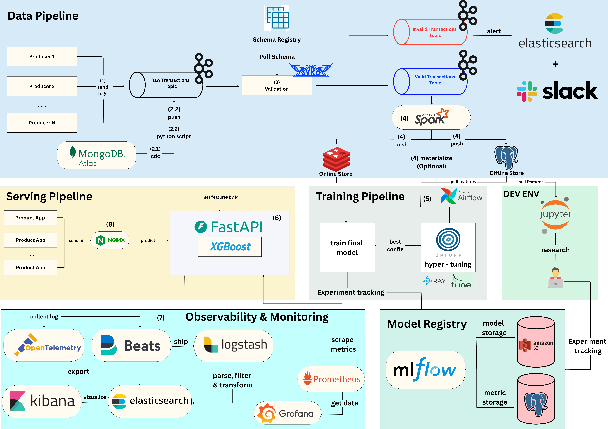

# Credit Card Transaction Fraud Detection ML System

An MLOps pipeline that transforms credit card transaction data into real-time fraud detection predictions. Built on modern open-source technologies including Kafka, Spark, Ray, and MLflow, this project demonstrates a complete ML lifecycle from data ingestion through model deployment. The system features automated CDC, real-time feature serving, and comprehensive observability.

## Table of Contents

- [📊 Dataset](#-dataset)
  - [File Structure](#file-structure)
  - [Modeling: Credit Card Transaction Fraud Prediction](#modeling-credit-card-transaction-fraud-detection)
- [🌐 Architecture Overview](#-architecture-overview)
  - [1. Data Pipeline](#1-data-pipeline)
    - [📤 Data Sources](#-data-sources)
    - [✅ Schema Validation](#-schema-validation)
    - [☁️ Storage Layer](#-storage-layer)
    - [🛒 Spark Streaming](#-spark-streaming)
  - [2. Training Pipeline](#2-training-pipeline)
    - [🌟 Training](#training)
    - [📦 Model Management](#-model-management)
  - [3. Serving Pipeline](#3-serving-pipeline)
    - [⚡ Model Serving](#-model-serving)
    - [🔍 Feature Service](#-feature-service)
  - [4. Observability](#4-observability)
    - [📡 Metrics & Monitoring](#-metrics--monitoring)
    - [🔒 Access Management](#-access-management)

## 📊 Dataset

> Credit Card Transactions Fraud Detection Dataset

The dataset can be found [here](https://www.kaggle.com/datasets/kartik2112/fraud-detection/data). This dataset contains a simulated credit card transaction dataset containing legitimate and fraud transactions.

The data spans 24 months (January 2019 to December 2020) and covers credit cards of 1000 customers doing transactions with a pool of 800 merchants.

### File Structure

| Field         | Description                                                          |
| ------------- | -------------------------------------------------------------------- |
| index    | Unique Identifier for each row                                |
| trans_date_trans_time    | Transaction DateTime                                      |
| cc_num    | Credit Card Number of Customer                                    |
| merchant   | Merchant Name                                          |
| category | Category of Merchant |
| amt         | Amount of Transaction                              |
| first         | First Name of Credit Card Holder                                                |
| last       | Last Name of Credit Card Holder                                            |
| gender  | Gender of Credit Card Holder         |
| street    | Street Address of Credit Card Holder                              |
| city    | City of Credit Card Holder                                     |
| state    | State of Credit Card Holder                                  |
| zip   | Zip of Credit Card Holder                                         |
| lat | Latitude Location of Credit Card Holder |
| long        | Longitude Location of Credit Card Holder                           |
| city_pop         | Credit Card Holder's City Population                                              |
| job       | Job of Credit Card Holder                                            |
| dob  | Date of Birth of Credit Card Holder         |
| trans_num    | Transaction Number                                    |
| unix_time   | UNIX Time of transaction                                          |
| merch_lat | Latitude Location of Merchant |
| merch_long        | Longitude Location of Merchant                               |
| is_fraud         | Fraud Flag                                              |

### Modeling: Credit Card Transaction Fraud Prediction

The core modeling task is to predict whether a credit card transaction is fraudulent at the moment it is processed.

You can download the dataset and put it under the `dataset` folder.

## 🌐 Architecture Overview

Note: I will write the complete README once the entire project is completed.
